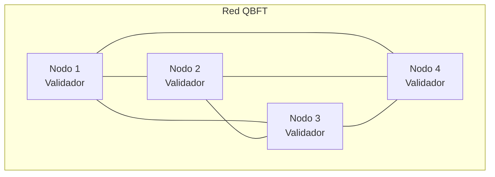

# Documentación de la Topología de la Red Blockchain (QBFT)

1. [Introducción](#1-introducción)
2. [Visión general de la red](#2-visión-general-de-la-red)
3. [Topología lógica](#3-topología-lógica)
4. [Nodos de la red](#4-nodos-de-la-red)
5. [Consenso y validadores](#5-consenso-y-validadores)
6. [Persistencia y almacenamiento](#6-persistencia-y-almacenamiento)
7. [Comunicación entre nodos](#7-comunicación-entre-nodos)
8. [Exposición de APIs](#8-exposición-de-apis)
9. [Consideraciones de seguridad](#9-consideraciones-de-seguridad)
10. [Evolución futura de la topología](#10-evolución-futura-de-la-topología)

## 1. Introducción
Este documento describe la **topología de la red blockchain permisionada** basada en **Hyperledger Besu** utilizando el algoritmo de consenso **QBFT (Quorum Byzantine Fault Tolerance)**.  
La red ha sido diseñada para ejecutarse inicialmente en un entorno controlado (Docker) y está preparada para su posterior despliegue en infraestructura distribuida (AWS y Kubernetes).

El objetivo de esta documentación es definir de forma clara:
- La estructura de la red
- El rol de cada nodo
- El mecanismo de consenso
- La comunicación entre nodos
- Las decisiones de diseño adoptadas

## 2. Visión general de la red
La red blockchain está compuesta por **múltiples nodos Besu** que participan en una red **permisionada** y **privada**.

> [!IMPORTANT]
> Todos los nodos comparten el mismo bloque génesis (`genesis.json`) y forman parte de un **consorcio cerrado**.

### Características principales
- Tipo de red: Privada / permisionada
- Cliente Ethereum: Hyperledger Besu
- Algoritmo de consenso: QBFT
- Persistencia de datos: LevelDB
- Comunicación: Red P2P Ethereum
- Exposición de APIs: JSON-RPC HTTP

## 3. Topología lógica
La topología lógica de la red es **peer-to-peer (P2P)**, sin nodos maestros ni jerarquía centralizada.
Todos los nodos:
- Mantienen una copia completa de la blockchain
- Participan en la validación de bloques
- Se comunican directamente entre sí

## 4. Nodos de la red
Cada nodo de la red ejecuta una instancia independiente de Besu y dispone de:
- Clave pública y privada propia
- Base de datos local persistente
- Conectividad P2P con el resto de nodos

### Roles de los nodos
En la configuración actual, todos los nodos tienen el mismo rol:
- Nodo completo (Full Node)
- Nodo validador (Validator)

> [!NOTE]
> No existen nodos de solo lectura ni nodos de archivo en esta fase del proyecto (en un futuro se podría implementar).

## 5. Consenso y validadores
### Algoritmo de consenso
La red utiliza QBFT (Quorum Byzantine Fault Tolerance), un algoritmo de consenso tolerante a fallos bizantinos, adecuado para redes permisionadas.
QBFT garantiza:
- Finalidad inmediata de los bloques
- Tolerancia a fallos de hasta ⌊(n−1)/3⌋ nodos
- Alta disponibilidad en entornos controlados

### Configuración de validadores
Los nodos validadores están definidos estáticamente en el bloque génesis, mediante el campo extraData.
- La lista de validadores se establece en el momento de creación de la red
- Todos los nodos comparten exactamente el mismo genesis.json
- Solo las direcciones incluidas pueden:
    - Proponer bloques
    - Participar en la validación
    - Firmar bloques QBFT

> [!NOTE]
> No se permite la incorporación dinámica de nuevos validadores en esta fase.

## 6. Persistencia y almacenamiento
Cada nodo mantiene su propio almacenamiento local mediante LevelDB, el sistema de almacenamiento por defecto de Besu.

### Datos persistidos
- Estado global de la blockchain
- Bloques y transacciones
- Metadatos del consenso QBFT

La persistencia se garantiza mediante el uso de volúmenes dedicados, lo que permite:
- Reinicios sin pérdida de datos
- Recuperación ante fallos
- Consistencia entre reinicios

## 7. Comunicación entre nodos
La comunicación entre nodos se realiza mediante el protocolo Ethereum P2P.

### Características de red
- Conexiones directas entre nodos
- Identificación mediante enode
- Intercambio de bloques, estados y mensajes de consenso

En el entorno distribuido (AWS), los nodos se identificarán mediante direcciones IP estáticas, evitando dependencias de DNS internos.

## 8. Exposición de APIs
Cada nodo expone una interfaz JSON-RPC HTTP que permite:
- Consulta del estado de la red
- Envío de transacciones
- Monitorización del consenso

Las APIs están destinadas a:
- Servicios backend
- Herramientas de administración
- Integraciones externas controladas

## 9. Consideraciones de seguridad
- La red es privada y no accesible públicamente
- Solo nodos autorizados pueden participar
- El consenso está restringido a validadores conocidos
- El bloque génesis actúa como raíz de confianza

> [!CAUTION]
> La seguridad de red (firewalls, control de acceso, certificados) se abordará en fases posteriores del proyecto.

## 10. Evolución futura de la topología
La topología actual sirve como base para las siguientes fases:
- Despliegue en AWS con nodos en máquinas físicas independientes
- Configuración de IPs públicas y privadas
- Orquestación mediante Kubernetes
- "Posible" introducción de nodos con roles diferenciados