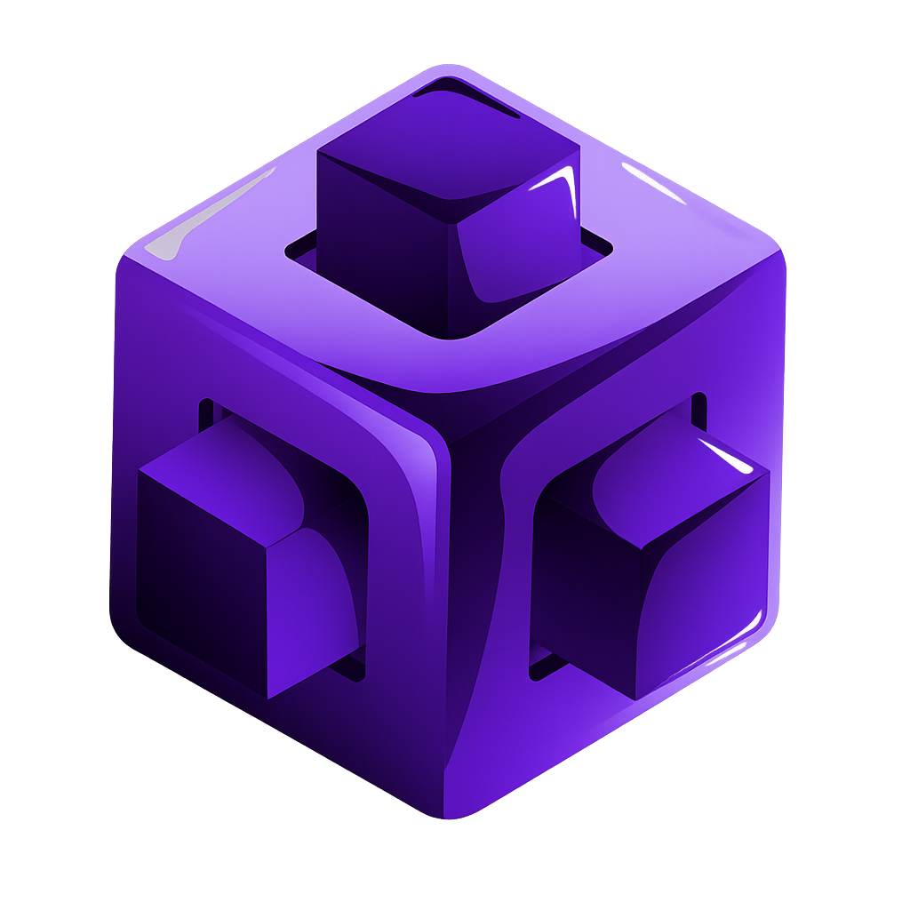

<table align="center">
  <tr>
    <td>
      
    </td>
    <td>
      <h1>AGORA</h1>
    </td>
  </tr>
</table>

<p align="center">
  
  
  
  
  
</p>

## Plataforma de votación digital segura y descentralizada
Agora es un proyecto de votación electrónica diseñado con un enfoque **profesional, seguro y escalable**, orientado a entornos donde la **fiabilidad, la trazabilidad y la protección de datos** son requisitos críticos (administraciones públicas, instituciones educativas, organizaciones privadas o procesos internos de alto impacto).
El sistema combina **autenticación mediante certificado electrónico**, una **arquitectura web moderna** y el uso de **tecnologías blockchain** para garantizar la integridad de los votos y la transparencia del proceso.


## Objetivos del proyecto
* Garantizar que **solo usuarios autenticados y válidos** puedan votar.
* Asegurar que cada voto sea **íntegro, inmutable y verificable**.
* Proteger la identidad del votante y cumplir con los principios de **seguridad y protección de datos**.
* Ofrecer una plataforma **escalable**, preparada para miles de usuarios concurrentes.
* Mantener una arquitectura clara, documentada y mantenible.
  

## Arquitectura general
Agora está diseñado siguiendo una arquitectura distribuida y modular:

* **Frontend**
  * Interfaz web moderna y responsive.
  * Visualización de resultados mediante gráficos (Chart.js).
  * Comunicación segura con el backend.

* **Backend**
  * API responsable de la lógica de negocio.
  * Validación de certificados electrónicos.
  * Gestión de usuarios, votaciones y resultados.

* **Base de datos relacional**
  * Almacenamiento de usuarios, elecciones y metadatos.
  * Control de accesos y trazabilidad.

* **Blockchain privada (Hyperledger Besu)**
  * Registro inmutable de los votos.
  * Generación del bloque génesis.
  * Red privada con múltiples nodos.

* **Infraestructura**
  * Contenedores Docker.
  * Servidor web Nginx.
  * Despligue en AWS con dominio propio (agorachain.es).
  * Preparado para balanceador de carga y alta disponibilidad.


## Seguridad
La seguridad es un pilar fundamental del proyecto:
* Autenticación mediante **certificado electrónico**.
* Comunicación cifrada mediante **TLS/HTTPS**.
* Separación clara de responsabilidades entre frontend y backend.
* Registro de operaciones para **auditoría y trazabilidad**.
* Diseño alineado con principios de **protección de datos (RGPD)**.


## Blockchain y votaciones
Los votos no se almacenan como simples registros modificables:
* Cada voto se registra como una **transacción**.
* Las transacciones se agrupan en **bloques**.
* Cada bloque incluye:
  * Número de bloque.
  * Timestamp UTC.
  * Hash SHA-256 del bloque anterior.
* Esto garantiza:
  * Inmutabilidad.
  * Transparencia.
  * Imposibilidad de alteración posterior.


## Visualización de resultados
* Gráficos de barras y pastel (Chart.js).
* Mapa de España (provincias/CCAA) en resultados con datos de escaños/votos cuando la votación está finalizada.
* Mapa de calor por provincia en **métricas** (intensidad según votos agregados por provincia).


## Escalabilidad y disponibilidad
Agora está preparado para crecer:
* Despliegue mediante Docker.
* Posibilidad de duplicar instancias del backend.
* Integración con **balanceador de carga**.
* Alta disponibilidad ante caídas de nodos.


## Tecnologías utilizadas
| Área | Tecnología |
|------|------------|
| Frontend | React (Vite), Chart.js, mapas SVG (resultados / heatmap métricas) |
| API principal | Laravel (PHP) — negocio, auth, envío de transacciones al nodo EVM |
| Servicio en tiempo real y D’Hondt | Spring Boot (Java) — escucha eventos de contrato, persistencia de votos, WebSocket, cálculo de escaños en BD |
| Contrato inteligente | Solidity (Hardhat); despliegue compatible con Besu |
| Blockchain | Hyperledger Besu (red QBFT en `QBFT-Network/`) o nodo local Hardhat en desarrollo |
| Base de datos | MariaDB (esquema en `db/`) |
| Infraestructura | Docker, Nginx, Kubernetes +AWS |
| Seguridad | TLS, certificados electrónicos (Sanctum, sesiones) |


## Estructura del proyecto (simplificada)
```
agora/
├── backend/          # Laravel API
├── frontend/         # React + Vite
├── votations/        # Spring Boot (listener, WebSocket, Ley D’Hondt)
├── blockchain/       # Hardhat, contrato SimpleVoting.sol
├── QBFT-Network/     # Red Besu QBFT (opcional / producción)
├── besu-kubernetes/  # Red besu Kubernetes (producción)
├── docker/
├── db/               # Scripts SQL de esquema
└── docs/             # Diagramas, entorno, [Arquitectura_Runtime.md](docs/Arquitectura_Runtime.md)
```

## Documentación
* **[docs/README.md](docs/README.md)** — índice de toda la documentación.
* **[docs/Environment_Setup.md](docs/Environment_Setup.md)** — Docker, variables `.env`, puertos.
* **[docs/Arquitectura_Runtime.md](docs/Arquitectura_Runtime.md)** — arquitectura real (Laravel, Spring, scheduler, flujo de votación).
* Diagramas (flujo, secuencia, ER, casos de uso) en `docs/`.
* Red blockchain: `QBFT-Network/docs/`.


## Estado del proyecto
Agora se encuentra en **desarrollo activo**, con un enfoque académico-profesional y una clara orientación a entornos reales de producción.


## Autor
Proyecto desarrollado por Oliver Gamboa Mesa y Rojohn Ibana Ibañares, con especial atención en la **seguridad, robustez y calidad del software**.

---

> [!NOTE]
> Agora no es solo una aplicación de votación: es una propuesta de **confianza digital**, donde cada voto cuenta y queda protegido.
