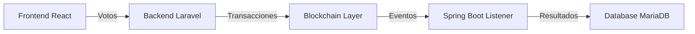
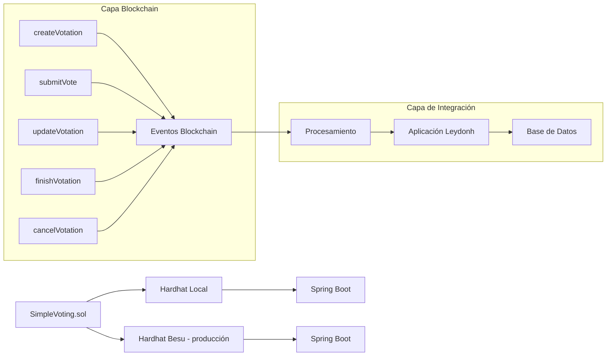
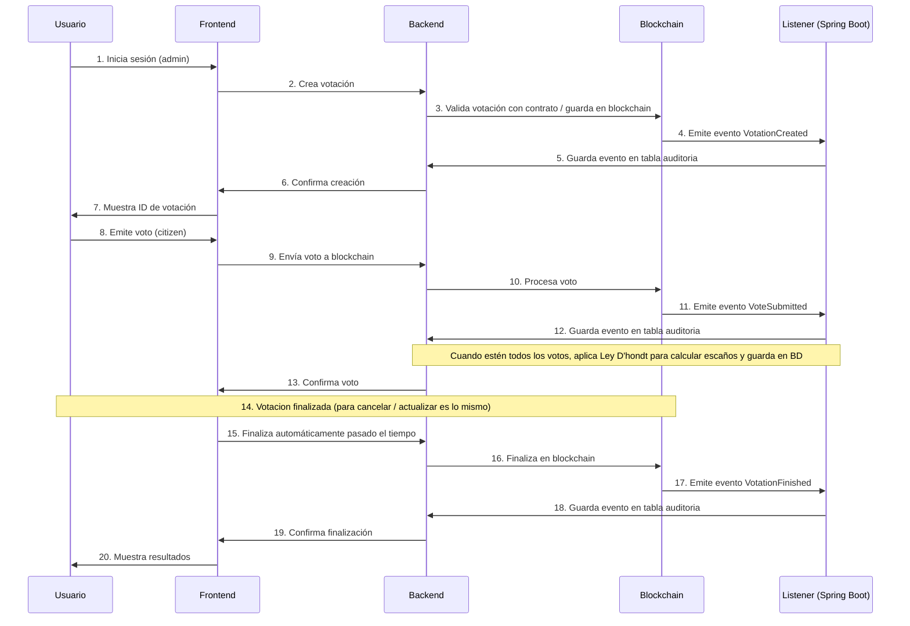
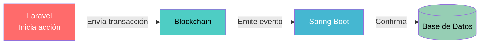

# Guía de Pruebas Locales - SimpleVoting.sol

## Tabla de Contenidos
1. [Introducción](#introducción)
2. [Estructura](#estructura)
3. [Despliegue del Contrato](#despliegue-del-contrato)
4. [Resumen de comandos](#resumen-de-comandos)
5. [Arquitectura del Sistema](#arquitectura-del-sistema)
6. [Flujo de Votaciones](#flujo-de-votaciones)
7. [Cálculo de Resultados](#cálculo-de-resultados-spring-boot)
8. [Seguridad y Diseño](#seguridad-y-diseño)
9. [Soporte y Recursos](#soporte-y-recursos)


## Introducción
Este documento describe cómo probar el contrato `SimpleVoting.sol` de manera local usando Hardhat y una red de prueba Ethereum. Además, explica cómo integrarlo con el backend de Laravel y scripts de producción.


## Estructura
```
blockchain/
├── artifacts/
├── cache/
├── contracts/
│   └── SimpleVoting.sol
├── scripts/
│   ├── deploy-simple.js
│   ├── test-simple.js
│   └── interact-simple.js
├── hardhat.config.js
└── docs/
    └── Local_Testing_Guide.md
```


## Despliegue del Contrato
### Paso 1: Compilar el contrato
```bash
# Abrir Terminal 1 y ejecutar:
npx hardhat compile
```

### Paso 2: Iniciar Red Local
```bash
npx hardhat node
```
> [!IMPORTANT]
> **No cerrar esta terminal** - Debe permanecer corriendo para las pruebas.

### Paso 3: Desplegar Contrato
```bash
# Abrir Terminal 2 (nueva) y ejecutar:
npx hardhat run scripts/deploy-simple.js --network localhost  # Despliegua contrato
npx hardhat run scripts/interact-simple.js --network localhost  # Interacción con distintos cases
npx hardhat run scripts/test-simple.js --network localhost  # Despliegue automatizado
```

### Error Común 1: "Cannot connect to network localhost"
**Causa:** La red local no está corriendo.
**Solución:**
```bash
# Asegurarse que hardhat node está corriendo en Terminal 1
npx hardhat node

# No se cierra esa terminal, se abre una nueva para desplegar
```

### Error Común 2: "Cannot read properties of undefined (reading 'formatEther')"
**Causa:** Versión incompatible de ethers.js.
**Solución:**
```bash
# El script ya está arreglado, usa la versión actualizada
npx hardhat run scripts/deploy-simple.js --network localhost
```

### Error Común 3: "Contract not deployed"
**Causa:** El contrato no se desplegó correctamente.
**Solución:**
```bash
# Verificar que el despliegue fue exitoso
npx hardhat run scripts/deploy-simple.js --network localhost
```
> [!TIP]
> **Busca el mensaje** "SimpleVoting desplegado en: "

### Error Común 4: "Account not found"
**Causa:** Usando una cuenta que no existe en la red local.
**Solución:**
```bash
# Usa las cuentas que muestra hardhat node
# Copia y pega las direcciones de la lista de cuentas
```


## Resumen de comandos
### Resumen de Todos los Comandos
```bash
# 1. Instalar dependencias
npm install

# 2. Compilar contrato
npx hardhat compile

# 3. Iniciar red local
npx hardhat node

# 4. Desplegar contrato
npx hardhat run scripts/deploy-simple.js --network localhost

# 5. Probar contrato
npx hardhat run scripts/interact-simple.js --network localhost

# 6. Pruebas automatizadas
npx hardhat run scripts/test-simple.js --network localhost
```

> [!NOTE]
> Hay comandos rápidos que se podrán encontrar en el archivo `package.json`


## Arquitectura del Sistema
### Flujo de Datos


### Componentes Blockchain


### Flujo de Votación Completo



## Flujo de Votaciones
### 1. Creación de Votación (Laravel → Blockchain)
El administrador crea una votación desde el frontend que se envía a Laravel.

**Laravel realiza:**
- Validación de datos de entrada
- Verificación de conexión blockchain
- Envío de transacción `createVotation` al smart contract
- Guardado en BD con state: **`pending`**
- Almacenamiento de `txHash` para trazabilidad

> [!IMPORTANT]
> Laravel **NO** marca la votación como `active`. La activación real ocurre cuando Spring Boot confirma el evento.

### 2. Confirmación en Blockchain (Spring Boot)
Spring Boot escucha constantemente eventos del contrato.

**Cuando se emite `VotationCreated`:**
1. Spring Boot detecta el evento
2. Actualiza la BD:
   - Estado → **`active`**
   - Asocia `blockchainId` (no se cómo lo haré, estoy pensando que es lo más óptimo para en un futuro tener más votaciones con diferentes blockchains)

### 3. Envío de Votos (Laravel → Blockchain)
El usuario vota desde el frontend.

**Laravel valida:**
- Autenticación del usuario
- Estado del usuario (`isActive`)
- Formato de `voteHash` (bytes32 válido)
- Que la votación esté **`active`**
- Rango de fechas válido (`startDate` < now < `endDate`)

**Proceso:**
1. Envía transacción `submitVote` con reintentos automáticos (máx. 3)
2. Retorna `txHash` al frontend

> [!IMPORTANT]
> Laravel **NO** guarda el voto en BD. Solo blockchain y Spring Boot procesan el voto.

### 4. Recepción de Votos (Spring Boot)
Spring Boot escucha el evento `VoteSubmitted`.

**Cuando llega un voto:**
1. Guarda el voto en BD de forma **anónima**:
   - `voteHash`
   - `votationId`
   - `party_Id`
   - `municipalityId`
   - `blockHash`
   - `txHash`
   - `createdAt`
> [!NOTE]   
> **No se guarda:** usuario ni identidad del votante

### 5. Actualización / Cancelación de Votaciones
**Desde Laravel:**
- Envía transacción (`updateVotation`, `cancelVotation`)
- Marca en BD como **`pending`**

**Spring Boot escucha:**
- `VotationUpdated` → Actualiza datos, estado → `active`
- `VotationCancelled` → Estado → `cancelled`

### 6. Finalización de Votación
1. Se ejecuta `finishVotation` en blockchain
2. Laravel marca como `pending`
3. Spring Boot escucha `VotationFinished`


## Cálculo de Resultados (Spring Boot)
Cuando la votación termina:

1. Obtiene todos los votos desde BD
2. Agrupa por:
   - Provincia (via `municipality → province`)
   - Partido
3. Aplica **Ley D'Hondt** por provincia:
   - Usa número de escaños por provincia
4. Guarda resultados finales en BD
5. Frontend los lee y los muestra en los gráficos


## Seguridad y Diseño
### Principios de Seguridad
| Principio | Implementación |
|-------------|----------------|
| **Validación estricta** | `voteHash` como bytes32 válido |
| **Anonimato real** | No se almacena identidad del votante |
| **Fuente de verdad** | Blockchain como autoridad final |
| **No confianza propia** | Laravel espera confirmación externa (Spring Boot) |
| **Sincronizador fiable** | Spring Boot actúa como puente verificado |

### Manejo de Errores
#### Laravel:
- Validaciones estrictas de entrada
- Reintentos de transacciones (máx. 3 intentos)
- Manejo de errores blockchain con rollback
- Verificación de conexión antes de transacción

#### BlockchainService:
- Timeout configurado
- Reintentos automáticos
- Espera de transaction receipt

#### Spring Boot:
- Listener resiliente a eventos
- Procesamiento asíncrono
- Cola de eventos para procesamiento ordenado

**Flujo de confianza:**

> [!NOTE]
> **Laravel NO actualiza BD directamente** — Espera la confirmación de Spring Boot basada en eventos blockchain


# Soporte y Recursos
### Documentación
- [Hardhat Documentation](https://hardhat.org/docs)
- [Ethers.js Documentation](https://docs.ethers.org/)
- [Solidity Documentation](https://docs.soliditylang.org/)
- [Hyperledger Besu Documentation](https://besu.hyperledger.org/)
- [Laravel Documentation](https://laravel.com/docs)
- [Spring Boot Documentation](https://spring.io/projects/spring-boot)

### En caso de no encontrar la solución a los problemas:
1. **Verificar los logs** en la terminal donde corre hardhat node
2. **Reiniciar la red local** (detener hardhat node y volver a iniciar)
3. **Limpiar y recompilar** (npx hardhat clean && npx hardhat compile)
4. **Verificar configuración** de hardhat.config.js
5. **Consultar la documentación** oficial de las herramientas