# Arquitectura y Despliegue del Sistema de Votación Electrónica con Blockchain

## Índice
1. [Introducción](#1-introducción)  
2. [Objetivos de la Arquitectura](#2-objetivos-de-la-arquitectura)  
3. [Visión General del Sistema](#3-visión-general-del-sistema)  
4. [Arquitectura de Contenedores](#4-arquitectura-de-contenedores)  
5. [Arquitectura Blockchain (Hyperledger Besu)](#5-arquitectura-blockchain-hyperledger-besu)  
6. [Servicio de Cálculo Electoral (Spring Boot – Ley D’Hondt)](#servicio-calculo-electoral)
7. [Diagrama de Arquitectura y Despliegue](#7-diagrama-de-arquitectura-y-despliegue)  
8. [Flujo de Votación](#8-flujo-de-votación)  
9. [Proceso de Cálculo Electoral](#9-proceso-de-cálculo-electoral)  
10. [Consideraciones de Seguridad](#10-consideraciones-de-seguridad)  

## 1. Introducción
Este documento describe la **arquitectura técnica y de despliegue** del sistema de votación electrónica basado en **tecnología blockchain**, diseñado para garantizar integridad, trazabilidad y transparencia en los procesos electorales.

La solución combina:
- Contenedores Docker para la aplicación principal.
- Infraestructura cloud en AWS.
- Red blockchain distribuida con **Hyperledger Besu**.
- Orquestación mediante **Kubernetes**.
- Servicios especializados para cálculo electoral conforme a la **Ley D’Hondt**.

## 2. Objetivos de la Arquitectura
La arquitectura persigue los siguientes objetivos clave:
- Garantizar la **inmutabilidad del voto** mediante blockchain.
- Separar claramente la **lógica de votación** del **cálculo electoral**.
- Asegurar la **escalabilidad horizontal** de la red blockchain.
- Facilitar despliegues reproducibles y auditables.
- Proporcionar una base sólida para certificación y auditoría institucional.

## 3. Visión General del Sistema
El sistema se estructura en tres grandes capas:

### 3.1 Capa de Presentación
- Interfaz web desarrollada en **React**.
- Acceso seguro mediante HTTPS.

### 3.2 Capa de Aplicación
- **Laravel API**: lógica principal de negocio, autenticación y validación.
- **Spring Boot**: servicio independiente para cálculos electorales avanzados.

### 3.3 Capa Blockchain y Persistencia
- **Hyperledger Besu** para el registro inmutable de votos.
- **MariaDB** para almacenamiento auxiliar y resultados agregados.

## 4. Arquitectura de Contenedores
La plataforma de aplicación se despliega mediante **Docker**, con los siguientes servicios:
| Servicio | Función |
|--------|--------|
| Nginx | Proxy inverso y servidor HTTPS |
| React Frontend | Interfaz de usuario |
| Laravel API | Gestión de votaciones y autenticación |
| Spring Boot | Cálculo electoral (Ley D’Hondt) |
| MariaDB | Persistencia relacional |
| Certbot | Gestión automática de certificados SSL |

Todos los contenedores se comunican a través de una red privada Docker, garantizando aislamiento y control del tráfico interno.

## 5. Arquitectura Blockchain (Hyperledger Besu)
La blockchain se despliega sobre **infraestructura AWS**, utilizando:
- Instancias **EC2 independientes** para cada nodo.
- Red **permissioned** basada en Hyperledger Besu.
- Registro inmutable de votos y eventos electorales.

Los nodos se organizan como un **cluster distribuido**, eliminando puntos únicos de fallo y facilitando la auditoría.

## 6. Servicio de Cálculo Electoral (Spring Boot – Ley D’Hondt)
El cálculo de escaños y resultados electorales se realiza mediante un servicio **Spring Boot** independiente, que:
- Consulta los votos directamente desde la blockchain.
- Aplica el algoritmo de reparto conforme a la **Ley D’Hondt**.
- Persiste resultados agregados en MariaDB.
- Proporciona los datos al frontend para su visualización.

Esta separación garantiza:
- Transparencia del proceso de votación.
- Reproducibilidad del cálculo.
- Independencia entre voto y resultado.

## 7. Diagrama de Arquitectura y Despliegue

<!-- %%architecture-beta
    %%service user(internet)[Usuarios]

    %%group cloud(logos:aws)[Infraestructura Cloud]
        %%group docker(logos:docker-icon)[Contenedores App] in cloud
            %%service nginx(logos:nginx)[Nginx HTTPS] in docker
            %%service react(logos:react)[React Frontend] in docker
            %%service laravel(logos:laravel)[Laravel API] in docker
            %%service spring(logos:spring-icon)[Spring Java] in docker
            %%service db(logos:mariadb-icon)[MariaDB] in docker
            %%service certbot(logos:letsencrypt)[Certbot SSL] in docker
        
        %%group blockchain(logos:ethereum-color)[Red Besu Blockchain] in cloud
            %%service k8s(logos:kubernetes)[K8s Master] in blockchain
            %%junction cluster in blockchain
            %%service n1(logos:aws-ec2)[Node 1] in blockchain
            %%service n2(logos:aws-ec2)[Node 2] in blockchain
            %%service n3(logos:aws-ec2)[Node 3] in blockchain
            %%service n4(logos:aws-ec2)[Node 4] in blockchain

    %% PROCESO DE VOTO
    %%user:R -- L:nginx
    %%nginx:B -- T:react
    %%react:B -- T:laravel
    
    %% Laravel valida y registra en Besu
    %%laravel:R -- L:k8s
    %%k8s:B -- T:cluster
    %%cluster:L -- R:n1
    %%cluster:R -- L:n2
    %%cluster:B -- T:n4
    %%cluster:B -- T:n3
    

    %% PROCESO LEY D'HONT (Batch)
    %% Spring lee de la Blockchain
    %%k8s:L -- R:spring
    
    %% Spring procesa, guarda en DB y sirve a React
    %%laravel:B -- T:db
    %%spring:B -- T:db
    %%spring:T -- B:react

    %% Mantenimiento
    %%certbot:T -- B:nginx -->

## 8. Flujo de Votación
1. El usuario accede al sistema mediante HTTPS.
2. Nginx enruta la petición al frontend React.
3. React interactúa con Laravel para autenticación y validación.
4. Laravel registra el voto en la blockchain Besu.
5. El voto queda almacenado de forma inmutable.

## 9. Proceso de Cálculo Electoral
1. El servicio Spring Boot consulta los votos desde la blockchain.
2. Se aplica el algoritmo de la Ley D’Hondt.
3. Los resultados se almacenan en MariaDB.
4. React consume los resultados para su visualización.

## 10. Consideraciones de Seguridad
La arquitectura incorpora múltiples mecanismos de seguridad:
- Autenticación fuerte mediante certificados electrónicos.
- Comunicaciones cifradas mediante TLS.
- Separación de responsabilidades entre voto y cálculo.
- Red blockchain distribuida y auditable.
- Aislamiento de servicios mediante contenedores.