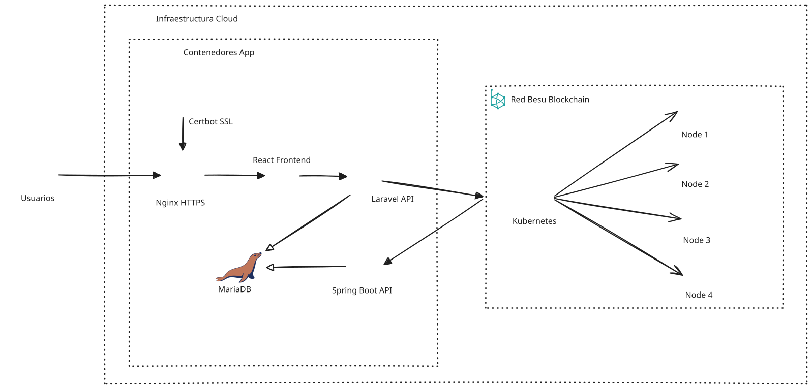

# Arquitectura y Despliegue del Sistema de Votación Electrónica con Blockchain

> **Nota:** La descripción detallada del comportamiento real (quién envía transacciones, cómo se programa el ciclo de vida de la votación, de dónde lee D’Hondt los datos) está en [**Arquitectura_Runtime.md**](Arquitectura_Runtime.md). Este documento conserva la visión de capas y despliegue

## Índice
1. [Introducción](#1-introducción)  
2. [Objetivos de la Arquitectura](#2-objetivos-de-la-arquitectura)  
3. [Visión General del Sistema](#3-visión-general-del-sistema)  
4. [Arquitectura de Contenedores](#4-arquitectura-de-contenedores)  
5. [Arquitectura Blockchain (Hyperledger Besu)](#5-arquitectura-blockchain-hyperledger-besu)  
6. [Servicio de Cálculo Electoral (Spring Boot – Ley D’Hondt)](#servicio-calculo-electoral)
7. [Diagrama de Arquitectura y Despliegue](#7-diagrama-de-arquitectura-y-despliegue)  
8. [Flujo de Votación](#8-flujo-de-votación)  
9. [Proceso de Cálculo Electoral](#9-proceso-de-cálculo-electoral)  
10. [Consideraciones de Seguridad](#10-consideraciones-de-seguridad)  

## 1. Introducción
Este documento describe la **arquitectura técnica y de despliegue** del sistema de votación electrónica basado en **tecnología blockchain**, diseñado para garantizar integridad, trazabilidad y transparencia en los procesos electorales.

La solución combina:
- Contenedores Docker para la aplicación principal.
- Infraestructura cloud en AWS.
- Red blockchain distribuida con **Hyperledger Besu**.
- Orquestación mediante **Kubernetes**.
- Servicios especializados para cálculo electoral conforme a la **Ley D’Hondt**.

## 2. Objetivos de la Arquitectura
La arquitectura persigue los siguientes objetivos clave:
- Garantizar la **inmutabilidad del voto** mediante blockchain.
- Separar claramente la **lógica de votación** del **cálculo electoral**.
- Asegurar la **escalabilidad horizontal** de la red blockchain.
- Facilitar despliegues reproducibles y auditables.
- Proporcionar una base sólida para certificación y auditoría institucional.

## 3. Visión General del Sistema
El sistema se estructura en tres grandes capas:

### 3.1 Capa de Presentación
- Interfaz web desarrollada en **React**.
- Acceso seguro mediante HTTPS.
- Panel de administración para votaciones, partidos, métricas y monitoreo.

### 3.2 Capa de Aplicación
- **Laravel API**: lógica principal de negocio, autenticación, validación y CRUD administrativo de votaciones y partidos.
- **Spring Boot**: servicio independiente para cálculos electorales avanzados.

### 3.3 Capa Blockchain y Persistencia
- **Hyperledger Besu** para el registro inmutable de votos.
- **MariaDB** para almacenamiento auxiliar y resultados agregados.

## 4. Arquitectura de Contenedores
La plataforma de aplicación se despliega mediante **Docker**, con los siguientes servicios:
| Servicio | Función |
|--------|--------|
| Nginx | Proxy inverso y servidor HTTPS |
| React Frontend | Interfaz de usuario |
| Laravel API | Gestión de votaciones, partidos y autenticación |
| Spring Boot | Cálculo electoral (Ley D’Hondt) |
| MariaDB | Persistencia relacional |
| Certbot | Gestión automática de certificados SSL |

Todos los contenedores se comunican a través de una red privada Docker, garantizando aislamiento y control del tráfico interno.

## 5. Arquitectura Blockchain (Hyperledger Besu)
La blockchain se despliega sobre **infraestructura AWS**, utilizando:
- Instancias **EC2 independientes** para cada nodo.
- Red **permissioned** basada en Hyperledger Besu.
- Registro inmutable de votos y eventos electorales.

Los nodos se organizan como un **cluster distribuido**, eliminando puntos únicos de fallo y facilitando la auditoría.

## 6. Servicio de Cálculo Electoral (Spring Boot – Ley D’Hondt)
El cálculo de escaños se ejecuta en **Spring Boot** tras el evento de cadena de **votación finalizada** (`VotationFinished`). El servicio:
- Lee los votos desde **MariaDB** (tabla `vote`), enlazando municipio → provincia.
- Aplica la **Ley D’Hondt** por circunscripción (escaños por provincia según `province.totalSeats`).
- Persiste el resultado en la tabla **`seat`**.
- El frontend de resultados consume principalmente la **API Laravel** (`/api/votations/{id}/results`), que lee esas filas.

Además, Spring Boot **escucha eventos** del contrato (Web3j), actualiza estados de votación en BD y ofrece **WebSocket** para métricas en vivo; **no sustituye** a Laravel en el envío de transacciones de creación de votación o de voto.

Esta separación garantiza:
- Transparencia del proceso de votación.
- Reproducibilidad del cálculo.
- Independencia entre voto y resultado.

## 7. Diagrama de Arquitectura y Despliegue

## 8. Flujo de Votación
1. El usuario accede al sistema mediante HTTPS (o HTTP en desarrollo).
2. Nginx (o acceso directo a Vite en dev) sirve el frontend React.
3. React interactúa con Laravel para autenticación y validación.
4. Laravel construye y envía la transacción `submitVote` al nodo EVM (Besu/Hardhat); el contrato emite eventos.
5. Spring Boot procesa el evento y persiste el voto en MariaDB; la cadena conserva la prueba inmutable del registro.

## 9. Proceso de Cálculo Electoral
1. Tras `finishVotation` en cadena, Spring Boot recibe el evento y marca la votación como finalizada en BD.
2. Se ejecuta el algoritmo de la Ley D’Hondt sobre los votos ya persistidos en MariaDB.
3. Los escaños por provincia/partido se guardan en la tabla `seat`.
4. React (pantalla de resultados) obtiene los agregados vía API Laravel.

## 10. Consideraciones de Seguridad
La arquitectura incorpora múltiples mecanismos de seguridad:
- Autenticación fuerte mediante certificados electrónicos.
- Comunicaciones cifradas mediante TLS.
- Separación de responsabilidades entre voto y cálculo.
- Red blockchain distribuida y auditable.
- Aislamiento de servicios mediante contenedores.