# Documentación de Casos de Uso – Ciudadano y Administrador

## Índice
1. [Introducción](#1-introducción)
2. [Arquitectura de Casos de Uso](#2-arquitectura-de-casos-de-uso)
3. [Actor: Ciudadano](#3-actor-ciudadano)
4. [Actor: Administrador](#4-actor-administrador) 

## 1. Introducción
Este documento detalla los casos de uso del sistema de votación electrónica. Se emplea tecnología **Blockchain** para garantizar la inmutabilidad y **Certificados Electrónicos** para la autenticación de los usuarios.

### Clasificación de CASOS DE USO
| Tipo | Descripción | Visualización en Diagrama |
| :--- | :--- | :--- |
| **Primario** | Aporta valor directo al usuario o proceso. | Cuadrado de color azul claro 🔵 |
| **Secundario** | Soporte técnico o requisito obligatorio. | Cuadrado de color blanco amarillento 🟡 |
| **Extendido** | Funcionalidad opcional dependiente de una condición. | Cuadrado de color naranja claro 🟠 |

## 2. Arquitectura de Casos de Uso

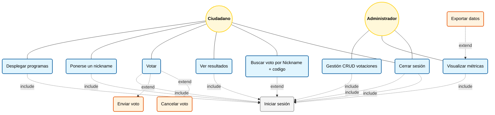

## 3. Actor: Ciudadano
### Caso de uso: Iniciar sesión
- **Tipo**: Secundario 🟡 (caso de soporte, incluido en todos los primarios)  
- **Descripción**: El ciudadano se autentica en el sistema mediante su certificado electrónico, requisito previo para realizar cualquier acción dentro del sistema.  
- **Actor principal**: Ciudadano  
- **Precondiciones**: El ciudadano dispone de un certificado electrónico válido.  
- **Postcondición**: El ciudadano queda autenticado y puede acceder al resto de funcionalidades.  
- **Flujo principal**:
  1. El usuario accede al sistema.  
  2. Selecciona o inserta su certificado electrónico.  
  3. El sistema verifica la validez.  
  4. Si es válido, se le concede acceso al entorno ciudadano.

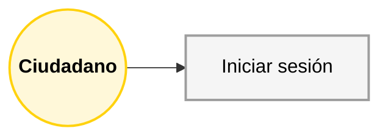

### Caso de uso: Desplegar programas electorales
- **Tipo**: Primario 🔵 
- **Incluye**: Iniciar sesión  
- **Descripción**: Permite visualizar los programas o propuestas electorales de los distintos candidatos o partidos disponibles.  
- **Flujo principal**:
  1. El ciudadano inicia sesión.  
  2. El ciudadano pincha sobre “Desplegar programas electorales”.  
  3. El sistema muestra los programas de los distintos candidatos o partidos. 
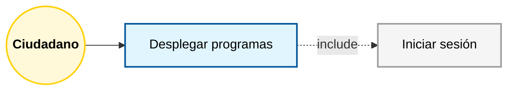

### Caso de uso: Ponerse un Nickname
- **Tipo**: Primario 🔵 
- **Incluye**: Iniciar sesión  
- **Descripción**: Permite ponerse un nickname para luego poder buscar a quien has votado gracias al nickname y un código que proporcionará el propio sistema. Cabe destacar que si se pierde ese código no se podrá comprobar a quién has votado  
- **Flujo principal**:
  1. El ciudadano inicia sesión.  
  2. El ciudadano pincha sobre “Perfil”.  
  3. El sistema muestra una serie de datos sobre el usuario y permite ponerse un nickname necesario para poder buscar luego el partido al que votó el usuario. 
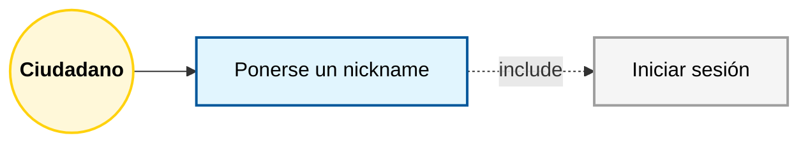

### Caso de uso: Votar
- **Tipo**: Primario 🔵
- **Incluye**: Iniciar sesión 
- **Extiende**: Enviar / Cancelar voto  
- **Descripción**: Permite al ciudadano poder emitir su voto dentro de una votación activa y registrada en la blockchain.  
- **Flujo principal**:
  1. El ciudadano inicia sesión.  
  2. Selecciona “Votar”.  
  3. Marca su opción y confirma.  
  4. El sistema envía el voto a la Blockchain y ejecuta el caso **Enviar voto** solo si quiere enviarlo (**extensión**).  
- **Extensión (Cancelar voto)**:  
  - Si el ciudadano decide no continuar, puede ejecutar el caso **Cancelar voto** antes de confirmar. 
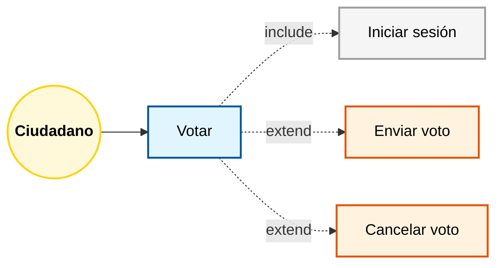

### Caso de uso: Enviar voto
- **Tipo**: Extendido 🟠 (opcional, depende del flujo “Votar”)  
- **Descripción**: Permite enviar la transacción de voto firmada digitalmente a la blockchain. Incluye validaciones criptográficas, prevención de votos duplicados y registro de auditoría.
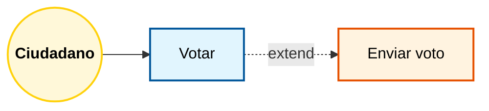

### Caso de uso: Cancelar voto
- **Tipo**: Extendido 🟠 (opcional, depende del flujo “Votar”)  
- **Descripción**: Permite anular el proceso antes de confirmar el envío del voto a la blockchain.  
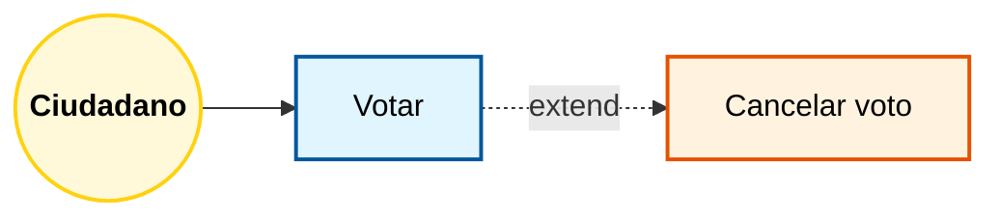

### Caso de uso: Ver resultados
- **Tipo**: Primario 🔵
- **Incluye**: Iniciar sesión  
- **Extiende**: Buscar voto por Nickname + Código
- **Descripción**: Permite al ciudadano ver a quién voto haciendo uso de la blockchain con registros inmutables.  
- **Flujo principal**:
  1. El ciudadano inicia sesión.  
  2. Selecciona “Ver resultados”.  
  3. Escribe su Nickname + código y el sistema se encarga de buscarlo en la blockchain y mostrarle el resultado al usuario. 
- **Extensión (Buscar a quién voto el usuario)**:  
  - Si el ciudadano quiere buscar a quién votó para corroborar su voto, puede ejecutar el caso **Buscar por nickname + código** en la pantalla Resultados.  
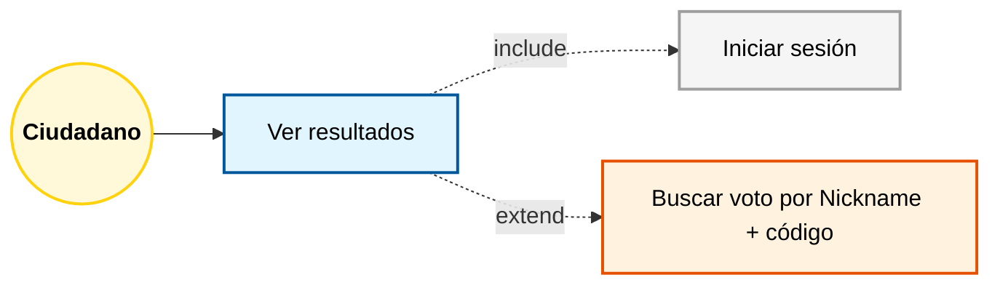

### Caso de uso: Busacr voto
- **Tipo**: Extendido 🟠 (opcional, depende del flujo “Ver resultados”)  
- **Descripción**: Permite buscar el voto de cada usuario escribiendo el Nickname + código que da el sistema cuando el usuario se pone un nickname **(IMPORTANTE no perder el código o no se podrás corrobar a quién votaste)**  
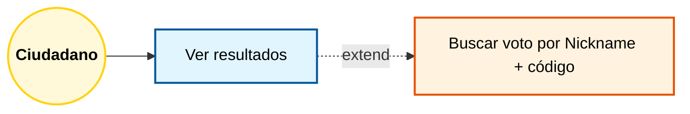

### Caso de uso: Salir
- **Tipo**: Primario 🔵
- **Incluye**: Iniciar sesión  
- **Descripción**: Permite al ciudadano cerrar sesión.  
- **Flujo principal**:
  1. El ciudadano inicia sesión.  
  2. Selecciona SALIR.  
  3. El sistema cierra su sesión.  
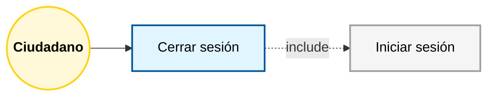

## 4. Actor: Administrador
### Caso de uso: Iniciar sesión
- **Tipo**: Secundario 🟡 (requisito previo para todos los casos del administrador)  
- **Descripción**: El administrador se autentica mediante su certificado electrónico institucional.  
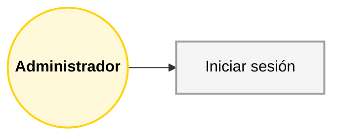

### Caso de uso: Gestionar votaciones
- **Tipo**: Primario 🔵
- **Incluye**: Iniciar sesión  
- **Descripción**: Permite al administrador crear, leer, actualizar o eliminar votaciones desde el panel de gestión (CRUD).  
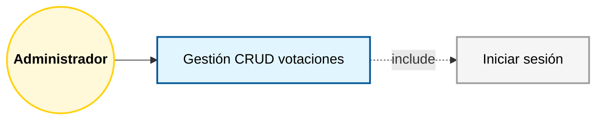

### Caso de uso: Visualizar métricas on-chain
- **Tipo**: Primario 🔵
- **Incluye**: Iniciar sesión  
- **Extiende**: Exportar métricas  
- **Descripción**: El administrador puede ver estadísticas en tiempo real sobre los votos emitidos, nodos activos y bloques generados.  
- **Extensión (Exportar métricas)**:  
  - Permite exportar los datos a un archivo CSV o PDF para su análisis o auditoría externa.  
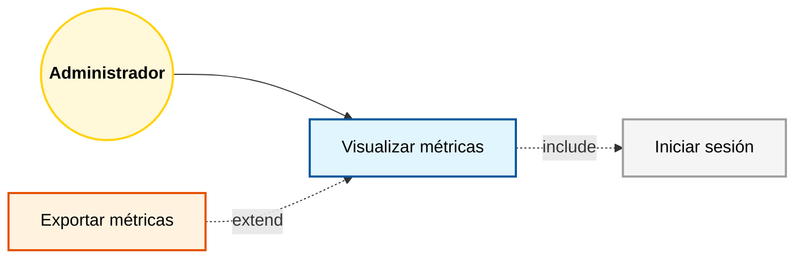

### Caso de uso: Exportar métricas
- **Tipo**: Extendido 🟠 (opcional, depende de “Visualizar métricas”)  
- **Descripción**: Genera un informe descargable con las métricas actuales del sistema.
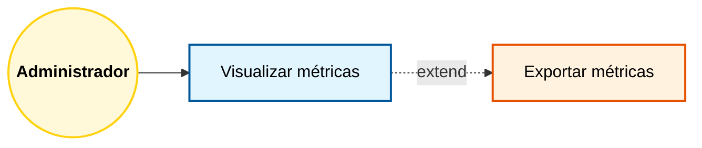

### Caso de uso: Salir
- **Tipo**: Primario 🔵
- **Incluye**: Iniciar sesión  
- **Descripción**: Permite al administrardor cerrar sesión.  
- **Flujo principal**:
  1. El administrador inicia sesión.  
  2. Selecciona SALIR.  
  3. El sistema cierra su sesión.  
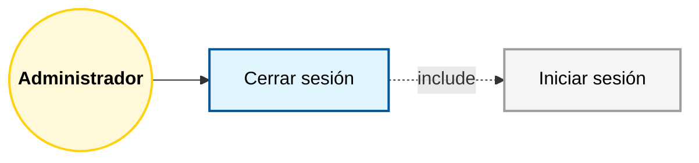
