# Modelo de Datos y Diagrama Entidad–Relación (ER)

## Índice
1. [Introducción](#1-introducción)
2. [Principios de Diseño del Modelo](#2-principios-de-diseño-del-modelo)
3. [Diagrama Entidad–Relación (ER)](#3-diagrama-entidadrelación-er)
4. [Descripción Detallada de las Entidades](#4-descripción-detallada-de-las-entidades) 
5. [Resumen de relaciones](#5-resumen-de-relaciones) 
6. [Descripción de las Relaciones](#6-descripción-de-las-relaciones) 
7. [Normalización](#7-normalización) 

# 1. Introducción
Este sistema de votaciones electrónicas está diseñado para garantizar:
1. Anonimato del voto 🔒
    - No existe relación directa entre USUARIOS y VOTOS
    - La tabla PARTICIPACIONES controla quién puede votar, pero no qué vota  
2. Inmutabilidad mediante Blockchain (Hyperledger Besu – QBFT) ⛓️
    - Los eventos de apertura y cierre de votaciones se referencian mediante hashes
    - La tabla BLOQUES actúa como puente verificable con la blockchain Besu  
3. Auditoría y trazabilidad completa 🔎
    - Toda acción crítica queda registrada en AUDITORIA
    - Cumple requisitos de trazabilidad y control legal  
4. Resultados electorales (Ley D’Hondt) 📊 
    - Los resultados se calculan externamente (Spring Boot)
    - Se almacenan en ESCAÑOS como datos agregados
    - Evita recalcular y mejora el rendimiento  

La base de datos relacional almacena únicamente información de gestión y auditoría, mientras que los votos y eventos críticos quedan registrados en blockchain mediante hashes, evitando cualquier vinculación directa entre usuario y voto.

> [!TIP]
> El modelo está totalmente normalizado (3FN) y preparado para entornos críticos y regulados.

## 2. Principios de Diseño del Modelo
El modelo de datos se ha diseñado siguiendo los siguientes principios:
1. Separación de responsabilidades
    - Identidad del usuario
    - Proceso electoral
    - Resultados
    - Auditoría
2. Anonimización del voto
    - No existe relación directa usuario–voto
    - Uso de hashes y entidades intermedias
3. Escalabilidad territorial
    - Estructura jerárquica administrativa
    - Soporte para cálculos provinciales y autonómicos
4. Integridad y verificabilidad
    - Enlace entre votaciones y bloques Blockchain
    - Registro inmutable de eventos críticos

## 3. Diagrama Entidad–Relación (ER)
El siguiente diagrama ER representa las entidades del sistema, así como sus relaciones y cardinalidades.
```mermaid
---
config:
  look: handDrawn
---
erDiagram
    direction TB

    %% RELACIONES
    user ||--o{ auditory : registra
    user ||--o{ participation : participa
    user }o--|| role : tiene
    user }o--|| municipality : pertenece

    municipality }o--|| province : pertenece
    province }o--|| autonomouscommunity : pertenece

    votation ||--o{ participation : incluye
    votation ||--o{ vote : genera
    votation ||--o{ seat : produce

    party ||--o{ vote : recibe
    party ||--o{ seat : obtiene
    province ||--o{ seat : tiene

    block ||--o{ votation : referencia

    %% TABLAS
    user {
        int id PK
        varchar name
        varchar nicknamePassword
        int roleId FK
        datetime registerDate
        boolean isActive
        varchar dni
        int municipalityId FK
    }

    role {
        int id PK
        varchar name
    }

    auditory {
        int id PK
        varchar action
        timestamp createdAt
        text description
    }

    votation {
        int id PK
        varchar startBlockHash FK
        varchar endBlockHash FK
        varchar title
        text description
        datetime startDate
        datetime endDate
        enum state
    }

    participation {
        int id PK
        int userId FK
        int votationId FK
    }

    vote {
        int id PK
        varchar voteHash
        varchar voteHashMunicipality
        int votationId FK
        int partyId FK
        timestamp createdAt
    }

    party {
        int id PK
        varchar name
    }

    seat {
        int id PK
        int votationId FK
        int provinceId FK
        int partyId FK
        int seatsAssigned
        int votes
        timestamp calculationDate
    }

    block {
        varchar hash PK
        int block_number
        varchar previousHash
        timestamp createdAt
        int transactions
        boolean isValid
    }

    municipality {
        int id PK
        int ineId
        int provinceId FK
        varchar name
    }

    province {
        int id PK
        int ineId
        int autonomousCommunityId FK
        varchar name
    }

    autonomouscommunity {
        int id PK
        varchar name
    }

    %% ESTILOS
    classDef entity fill:#261a58,stroke-width:2px
    class user,role,auditory,municipality,province,autonomouscommunity,block,votation,participation,vote,party,seat entity
```

## 4. Descripción Detallada de las Entidades
### 4.1 Usuario (user)
Representa a los ciudadanos y operadores del sistema.
- Gestiona identidad y estado de activación
- Se asocia a un rol y a una ubicación administrativa a través de código del INE
- No se vincula directamente con el voto
- Todas sus acciones son auditables
```mermaid
---
config:
  look: handDrawn
---
erDiagram
    direction TB

    %% RELACIONES
    user ||--o{ auditory : registra
    user ||--o{ participation : participa
    user }o--|| role : tiene
    user }o--|| municipality : pertenece

    %% TABLAS
    user {
        int id PK
        varchar name
        varchar nicknamePassword
        int roleId FK
        datetime registerDate
        boolean isActive
        varchar dni
        int municipalityId FK
    }

    %% ESTILOS
    classDef entity fill:#261a58,stroke-width:2px
    class user, auditory, participation, role, municipality entity
```

### 4.2 Rol (role)
Define el nivel de permisos dentro del sistema. Ejemplos:
- Administrador
- Ciudadano
- Auditor (en un futuro lo podríamos meter)
```mermaid
---
config:
  look: handDrawn
---
erDiagram
    direction RL

    %% RELACIONES
    user }o--|| role : tiene

    %% TABLAS
    role {
        int id PK
        varchar name
    }

    %% ESTILOS
    classDef entity fill:#261a58,stroke-width:2px
    class user,role entity
```

> [!NOTE]
> Permite aplicar control de acceso basado en roles.

### 4.3 Auditoría (auditory)
Registra todas las acciones relevantes del sistema:
- Inicio y cierre de sesión
- Emisión y validación de votos
- Cálculo de resultados
- Operaciones administrativas
```mermaid
---
config:
  look: handDrawn
---
erDiagram
    direction RL

    %% RELACIONES
    user ||--o{ auditory : registra

    %% TABLAS
    auditory {
        int id PK
        varchar action
        timestamp createdAt
        text description
    }

    %% ESTILOS
    classDef entity fill:#261a58,stroke-width:2px
    class user,auditory entity
```

> [!NOTE]
> Es esencial para transparencia y cumplimiento normativo.

### 4.4 Votación (votation)
Entidad central del sistema electoral. Incluye:
- Periodo de validez
- Estado del proceso
- Referencias a bloques Blockchain de inicio y cierre
```mermaid
---
config:
  look: handDrawn
---
erDiagram
    direction LR

    %% RELACIONES
    votation ||--o{ participation : incluye
    votation ||--o{ vote : contiene
    votation ||--o{ seat : produce
    block ||--o{ votation : referencia

    %% TABLAS
    votation {
        int id PK
        varchar startBlockHash FK
        varchar endBlockHash FK
        varchar title
        text description
        datetime startDate
        datetime endDate
        enum state
    }

    %% ESTILOS
    classDef entity fill:#261a58,stroke-width:2px
    class votation,participation,vote,seat, party, block entity
```

### 4.5 Participación (participation)
Entidad intermedia que:
- Relaciona usuarios con votaciones
- Garantiza una única participación por votación
- Evita el doble voto sin comprometer anonimato
```mermaid
---
config:
  look: handDrawn
---
erDiagram
    direction RL

    %% RELACIONES
    user ||--o{ participation : participa
    votation ||--o{ participation : incluye

    %% TABLAS
    participation {
        int id PK
        int userId FK
        int votationId FK
    }

    %% ESTILOS
    classDef entity fill:#261a58,stroke-width:2px
    class user,votation,participation entity
```

### 4.6 Voto (vote)
Representa el voto emitido.
- No contiene información identificativa del usuario
- Se almacena mediante hashes
- Se vincula a partido y votación
- Puede verificarse con Blockchain
```mermaid
---
config:
  look: handDrawn
---
erDiagram
    direction RL

    %% RELACIONES
    votation ||--o{ vote : genera
    party ||--o{ vote : recibe

    %% TABLAS
    vote {
        int id PK
        varchar voteHash
        varchar voteHashMunicipality
        int votationId FK
        int partyId FK
        timestamp createdAt
    }

    %% ESTILOS
    classDef entity fill:#261a58,stroke-width:2px
    class vote,party,votation entity
```

### 4.7 Partido (party)
Representa las candidaturas políticas participantes. Se utiliza para:
- Conteo de votos
- Asignación de escaños
```mermaid
---
config:
  look: handDrawn
---
erDiagram
    direction LR

    %% RELACIONES
    party ||--o{ vote : recibe
    party ||--o{ seat : obtiene

    %% TABLAS
    party {
        int id PK
        varchar name
    }

    %% ESTILOS
    classDef entity fill:#261a58,stroke-width:2px
    class vote,party,seat, votation entity
```

### 4.8 Escaños (seat)
Resultado del proceso de cálculo electoral.
- Calculado mediante Ley D’Hondt
- Asociado a provincia y partido
- Incluye número de votos y fecha de cálculo
```mermaid
---
config:
  look: handDrawn
---
erDiagram
    direction RL

    %% RELACIONES
    votation ||--o{ seat : produce
    party ||--o{ seat : obtiene
    province ||--o{ seat : tiene

    %% TABLAS
    seat {
        int id PK
        int votationId FK
        int provinceId FK
        int partyId FK
        int seatsAssigned
        int votes
        timestamp calculationDate
    }

    %% ESTILOS
    classDef entity fill:#261a58,stroke-width:2px
    class seat, votation, party, province entity
```

### 4.9 Bloque (block)
Representa un bloque de la Blockchain.
- Garantiza inmutabilidad
- Enlaza votaciones con la cadena
- Permite verificación externa
```mermaid
---
config:
  look: handDrawn
---
erDiagram
    direction LR

    %% RELACIONES
    block ||--o{ votation : referencia

    %% TABLAS
    block {
        varchar hash PK
        int block_number
        varchar previousHash
        timestamp createdAt
        int transactions
        boolean isValid
    }

    %% ESTILOS
    classDef entity fill:#261a58,stroke-width:2px
    class block, votation entity
```

### 4.10 División Territorial
Estructura jerárquica:
1. Comunidad Autónoma
2. Provincia
3. Municipio

Permite:
- Resultados desagregados
- Cálculos electorales por territorio
- Escalabilidad nacional
```mermaid
---
config:
  look: handDrawn
---
erDiagram
    direction RL

    %% RELACIONES
    user }o--|| municipality : pertenece
    municipality }o--|| province : pertenece
    province }o--|| autonomouscommunity : pertenece

    %% TABLAS
    municipality {
        int id PK
        int ineId
        int provinceId FK
        varchar name
    }

    province {
        int id PK
        int ineId
        int autonomousCommunityId FK
        varchar name
    }

    autonomouscommunity {
        int id PK
        varchar name
    }

    %% ESTILOS
    classDef entity fill:#261a58,stroke-width:2px
    class user, municipality, province, autonomouscommunity entity
```

## 5. Resumen de relaciones
- usuarios (1) → (N) auditoria
- usuarios (1) → (1) rol
- usuarios (1) → (1) municipio
- municipio (N) → (1) provincia
- provincia (N) → (1) comunidad_autonoma
- usuarios (1) → (N) participaciones
- votacion (1) → (N) participaciones
- votacion (1) → (N) escaños
- escaños (N) → (1) provincia
- escaños (N) → (1) partido
- votos (N) ← (1) partido
- votacion (1) → (N) votos
- bloques (1) ← (N) votaciones (relación indirecta por hash de inicio)
- bloques (1) ← (N) votaciones (relación indirecta por hash de fin)

> [!IMPORTANT]
> **Los usuarios no se relacionan directamente con los votos para preservar el anonimato.**

## 6. Descripción de las Relaciones
1. Un usuario:
    - Puede participar en múltiples votaciones
    - Genera múltiples registros de auditoría
    - Pertenece a un único municipio y rol
2. Una votación:
    - Incluye múltiples participaciones
    - Genera votos
    - Produce escaños
    - Se ancla a la Blockchain
3. Un partido:
    - Recibe votos
    - Obtiene escaños
- La jerarquía territorial es estricta y normalizada

## 7. Normalización
El modelo cumple estrictamente:
- 1FN → atributos atómicos
- 2FN → dependencia total de la PK
- 3FN → sin dependencias transitivas

Además:
- Sin redundancias
- Integridad referencial
- Escalable y mantenible
