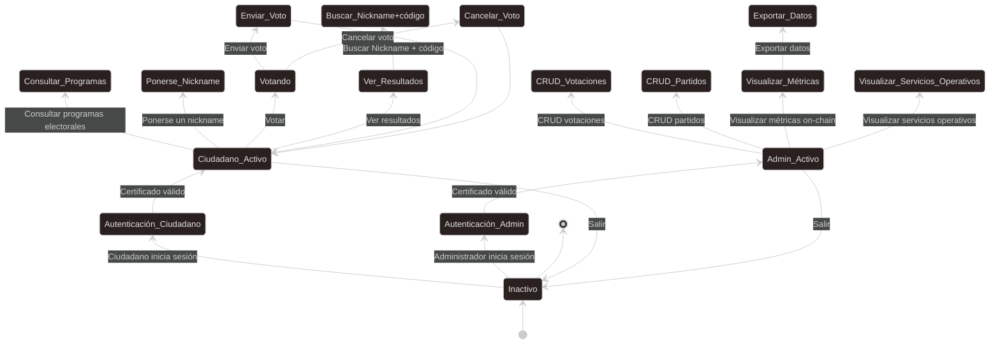
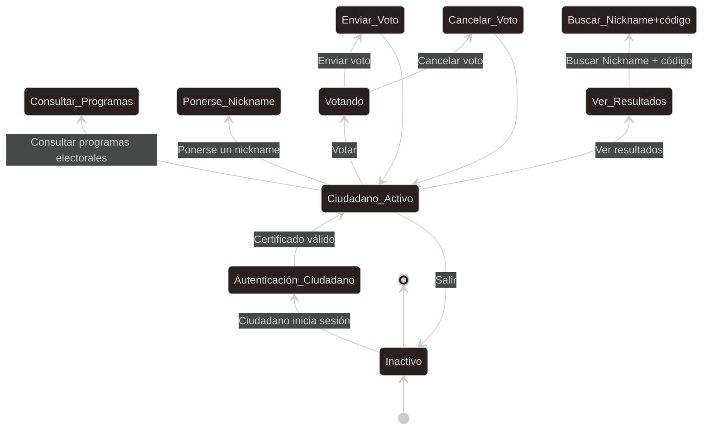
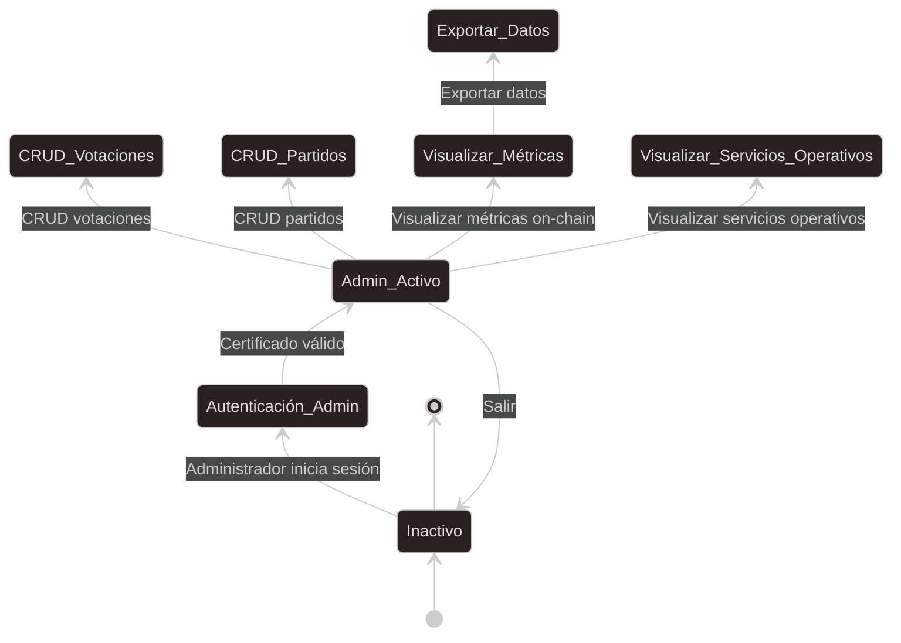

# Documentación del Diagrama de Estado  

## Índice
1. [Introducción](#1-introducción)  
2. [Objetivo del Diagrama de Estado](#2-objetivo-del-diagrama-de-estado)  
3. [Convenciones UML Utilizadas](#3-convenciones-uml-utilizadas)  
4. [Estados del Actor: Ciudadano](#4-estados-del-actor-ciudadano)  
5. [Estados del Actor: Administrador](#5-estados-del-actor-administrador)  
6. [Relación con Casos de Uso](#6-relación-con-los-casos-de-uso)  

## 1. Introducción
Este documento describe el **diagrama de estado** del Sistema de Votación Electrónica, que permite modelar los **estados dinámicos** del sistema y las transiciones según las acciones de los actores.

Mientras que los diagramas de secuencia representan **la interacción temporal**, el diagrama de estado muestra **los estados posibles del sistema y sus transiciones**, garantizando que los flujos sean consistentes con los casos de uso y la seguridad de la blockchain.

## 2. Objetivo del Diagrama de Estado
- Modelar los **estados del sistema** según las acciones de Ciudadano y Administrador.
- Representar **transiciones críticas** como:
  - Inicio y cierre de sesión.
  - Emisión y cancelación de votos.
  - Gestión CRUD de votaciones y partidos, monitoreo de servicios y exportación de métricas.
- Garantizar la **coherencia del flujo** y la trazabilidad de las acciones.
- Facilitar la comprensión de los procesos para desarrolladores y auditores.

## 3. Convenciones UML Utilizadas
- **Estado inicial**: Punto de inicio del sistema.
- **Estados**: Representan situaciones en que el sistema permanece mientras espera acciones.
- **Transiciones**: Flechas etiquetadas con la acción que produce el cambio de estado.
- **Estados compuestos**: Algunos estados (como `Ciudadano_Activo`) incluyen sub-acciones (Votar, Enviar voto, Cancelar voto).
- **Estado final**: Cierre de sesión o finalización de un proceso.  
A continuación, se muestra el diagrama de estado completo:

## 4. Estados del Actor: Ciudadano
### Flujo de estados
1. El ciudadano se encuentra en el estado **Inactivo**.  
2. Inicia sesión mediante certificado electrónico → **Autenticación_Ciudadano**.  
3. Certificado válido → **Ciudadano_Activo**.  
4. Acciones disponibles en **Ciudadano_Activo**:
   - `Consultar_Programas` → consulta de programas electorales.  
   - `Ponerse_Nickname` → definición del nickname para verificación posterior.
   - `Votando` → flujo de votación:
     - `Enviar_Voto` → voto registrado en Blockchain.  
     - `Cancelar_Voto` → voto anulado antes de confirmación.  
   - `Ver_Resultados` → consulta de resultados.
     - `Buscar por nickname + código` → consulta tú voto.  
5. Ciudadano finaliza sesión → vuelve a **Inactivo**.

## 5. Estados del Actor: Administrador
### Flujo de estados
1. El administrador parte del estado **Inactivo**.  
2. Inicia sesión → **Autenticación_Admin**.  
3. Certificado válido → **Admin_Activo**.  
4. Acciones disponibles en **Admin_Activo**:
   - `CRUD_Votaciones` → gestión de votaciones (crear, leer, actualizar, eliminar).  
   - `CRUD_Partidos` → gestión de partidos (crear, leer, actualizar y desactivar).
   - `Visualizar_Metricas` → consulta de métricas on-chain.
   - `Visualizar_Servicios_Operativos` → consulta del estado de Laravel, MariaDB, Blockchain RPC, Spring Boot, WebSocket y cluster Besu/Kubernetes.
   - `Exportar_Datos` → flujo opcional de exportación de métricas.  
5. Administrador finaliza sesión → vuelve a **Inactivo**.

## 6. Relación con los Casos de Uso
- Los estados corresponden a **los mismos casos de uso previamente definidos**, asegurando coherencia:  
  - Iniciar sesión  
  - Consultar programas electorales  
  - Ponerse un nickname
  - Votar / Enviar voto / Cancelar voto  
  - Ver resultados  
  - CRUD votaciones  
  - CRUD partidos
  - Visualizar servicios operativos
  - Visualizar métricas / Exportar datos  

- Permite **ver la vida de cada acción** y la transición entre estados, garantizando trazabilidad y consistencia.