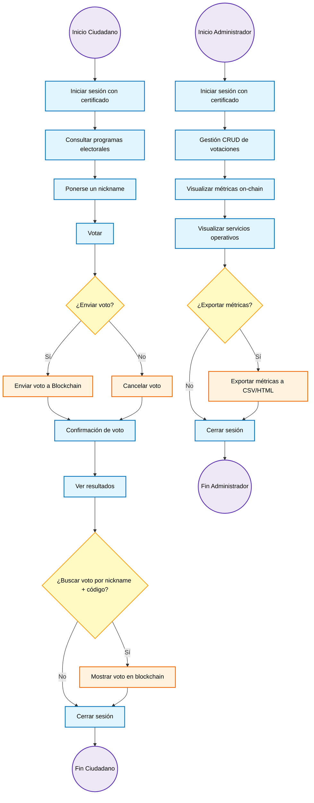

# Documentación de Diagrama de Flujo

## Índice
1. [Introducción](#1-introducción)
2. [Convenciones del Diagrama de Flujo](#2-convenciones-del-diagrama-de-flujo)
3. [Flujo Ciudadano](#3-flujo-ciudadano)
4. [Flujo Administrador](#4-flujo-administrador)

## 1. Introducción
Este diagrama de flujo muestra el recorrido lógico de los usuarios dentro del **sistema de votación electrónica**.  
Permite visualizar **procesos, decisiones y resultados** de manera clara, incluyendo la interacción con la **Blockchain** y la autenticación mediante **certificados electrónicos**.

Se incluyen flujos para:
- **Ciudadano**: inicio de sesión, votación, visualización de resultados, gestión de nickname y cierre de sesión.  
- **Administrador**: inicio de sesión, gestión CRUD de votaciones, métricas on-chain, monitoreo de servicios, exportación de datos y cierre de sesión.

## 2. Convenciones del Diagrama de Flujo
| Símbolo | Tipo | Descripción |
|---------|------|-------------|
| 🟦 Rectángulo azul | Proceso | Representa una acción o tarea que realiza el usuario o el sistema |
| 🟡 Rombo amarillo | Decisión | Representa una bifurcación según una condición o respuesta |
| 🟣 Círculo morado claro | Inicio / Fin | Marca el inicio o el final de un flujo |
| 🟧 Rectángulo naranja | Proceso opcional / Extendido | Representa funcionalidades condicionales, como "Enviar voto" o "Cancelar voto" |

  A continuación, se muestra el diagrama de flujo completo:

## 3. Flujo Ciudadano
Descripción del flujo Ciudadano:
1. **Inicio**: El ciudadano accede al sistema.
2. **Iniciar sesión**: Se autentica mediante certificado electrónico.
3. **Consultar programas**: Visualiza los programas electorales.
4. **Ponerse un nickname**: Necesario para consultar posteriormente a quién votó.
5. **Votar**: Marca su opción y decide enviar o cancelar el voto.
6. **Decisión de envío**:
    - `Enviar voto`: Se registra en la Blockchain y confirma el envío.
    - `Cancelar voto`: Se anula la acción antes del envío.
7. **Ver resultados**: Puede consultar resultados generales.
    - `Buscar voto por nickname + código`: Permite corroborar su propio voto.
8. **Salir**: Cierra sesión.

```mermaid
flowchart LR
    %% Estilos
    classDef inicioFin fill:#ede7f6,stroke:#5e35b1,stroke-width:2px,color:#000
    classDef proceso fill:#e1f5fe,stroke:#0277bd,stroke-width:2px,color:#000
    classDef decision fill:#fff9c4,stroke:#f9a825,stroke-width:2px,color:#000
    classDef extendido fill:#fff3e0,stroke:#ef6c00,stroke-width:2px,color:#000

    %% Flujo Ciudadano
    InicioC((Inicio Ciudadano)):::inicioFin

    InicioC --> LoginC[Iniciar sesión con certificado]:::proceso
    LoginC --> ProgramasC[Consultar programas electorales]:::proceso
    ProgramasC --> NicknameC[Ponerse un nickname]:::proceso
    NicknameC --> VotarC[Votar]:::proceso

    VotarC --> DecisionV{¿Enviar voto?}:::decision
    DecisionV -->|Sí| EnviarC[Enviar voto a Blockchain]:::extendido
    DecisionV -->|No| CancelarC[Cancelar voto]:::extendido

    EnviarC --> FinVotoC[Confirmación de voto]:::proceso
    CancelarC --> FinVotoC
    FinVotoC --> ResultadosC[Ver resultados]:::proceso

    ResultadosC --> BuscarC{¿Buscar voto por nickname + código?}:::decision
    BuscarC -->|Sí| BuscarV[Mostrar voto en blockchain]:::extendido
    BuscarC -->|No| SalirC[Cerrar sesión]:::proceso
    BuscarV --> SalirC
    SalirC --> FinC((Fin Ciudadano)):::inicioFin
```

## 4. Flujo Administrador
Descripción del flujo Administrador:
1. **Inicio**: El administrador accede al sistema.
2. **Iniciar sesión**: Se autentica mediante certificado electrónico institucional.
3. **Gestión CRUD**: Puede crear, leer, actualizar o eliminar votaciones.
4. **Visualizar métricas**: Consulta estadísticas en tiempo real sobre votos, nodos activos y bloques.
5. **Visualizar servicios operativos**: Consulta el estado de Laravel, MariaDB, Blockchain RPC, Spring Boot, WebSocket y cluster Besu/Kubernetes.
6. **Decisión de exportación**:
    - `Exportar métricas`: Descarga en CSV o HTML para auditoría externa.
    - `No exportar`: Continúa al cierre de sesión.
7. **Salir**: Cierra sesión del sistema.

```mermaid
flowchart LR
    %% Estilos
    classDef inicioFin fill:#ede7f6,stroke:#5e35b1,stroke-width:2px,color:#000
    classDef proceso fill:#e1f5fe,stroke:#0277bd,stroke-width:2px,color:#000
    classDef decision fill:#fff9c4,stroke:#f9a825,stroke-width:2px,color:#000
    classDef extendido fill:#fff3e0,stroke:#ef6c00,stroke-width:2px,color:#000

    %% Flujo Administrador
    InicioA((Inicio Administrador)):::inicioFin

    InicioA --> LoginA[Iniciar sesión con certificado]:::proceso
    LoginA --> CRUDA[Gestión CRUD de votaciones]:::proceso
    CRUDA --> MetricA[Visualizar métricas on-chain]:::proceso
    MetricA --> MonitorA[Visualizar servicios operativos]:::proceso

    MonitorA --> DecisionExp{¿Exportar métricas?}:::decision
    DecisionExp -->|Sí| ExportA[Exportar métricas a CSV/HTML]:::extendido
    DecisionExp -->|No| SalirA[Cerrar sesión]:::proceso
    ExportA --> SalirA
    SalirA --> FinA((Fin Administrador)):::inicioFin
```
