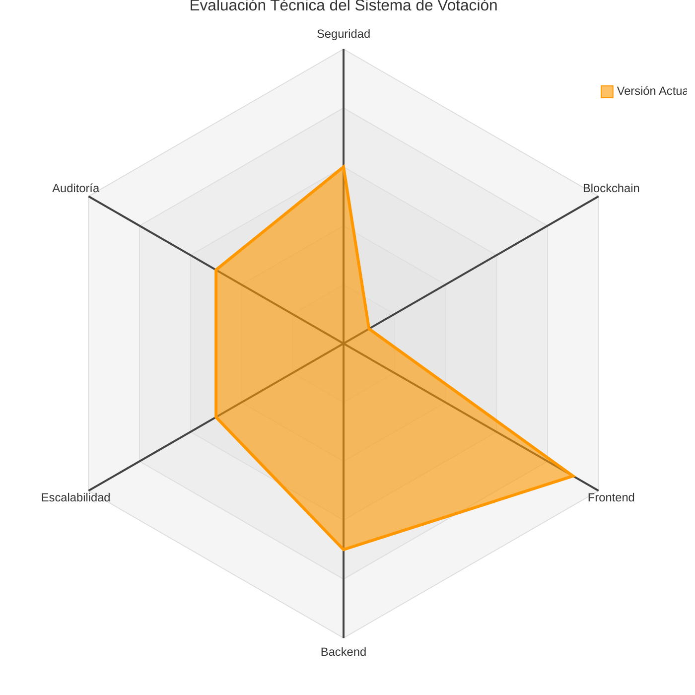

# Visión General de AGORA — Diagrama Radar

## 1. Introducción
Este proyecto implementa una **plataforma de votación electrónica segura**, basada en **Blockchain**, con autenticación mediante **certificado electrónico**, diferenciación de roles (Ciudadano / Administrador) y trazabilidad completa de los votos.

Para ofrecer una **visión global y comparativa** del estado del sistema, se utiliza un **diagrama radar**. Este tipo de diagrama permite representar de forma clara el grado de desarrollo, madurez o énfasis de distintas dimensiones del proyecto en un único gráfico.

## 2. ¿Por qué un Diagrama Radar?
El **diagrama radar** (también conocido como *spider chart* o *Kiviat diagram*) se utiliza habitualmente para:
- Comparar múltiples dimensiones de un sistema complejo
- Evaluar el equilibrio entre áreas técnicas
- Visualizar fortalezas y debilidades de un proyecto
- Presentar información técnica de forma sintética y comprensible

En este proyecto, el radar se emplea para **evaluar el estado funcional y técnico** de los principales pilares del sistema.

## 3. Dimensiones Evaluadas
Cada eje del diagrama representa un componente crítico del sistema:
| Dimensión | Descripción |
|---------|-------------|
| **Seguridad** | Uso de certificados electrónicos, control de acceso y validación de identidad |
| **Blockchain** | Registro inmutable de votos, consenso y trazabilidad |
| **Frontend** | Interfaz de usuario, experiencia y accesibilidad |
| **Backend** | API, lógica de negocio, control de permisos |
| **Escalabilidad** | Capacidad de crecimiento y adaptación del sistema |
| **Auditoría** | Verificación, transparencia y métricas on-chain |

 La escala utilizada va de **0 a 10**, donde:
- 0 = No implementado
- 5 = Totalmente implementado / maduro

## 4. Diagrama Radar de AGORA

## 5. Interpretación del Diagrama
1. Seguridad deberá ser el eje más fuerte del sistema, gracias al uso de certificados electrónicos y control de identidad.
2. Blockchain y Auditoría presentarán un alto nivel de madurez, garantizando integridad y transparencia.
3. Backend se encuentra bien estructurado, soportando roles, permisos y lógica de negocio.
4. Frontend y Escalabilidad están correctamente definidos, pero abiertos a mejoras futuras (optimización UX, balanceo de carga, despliegue distribuido).