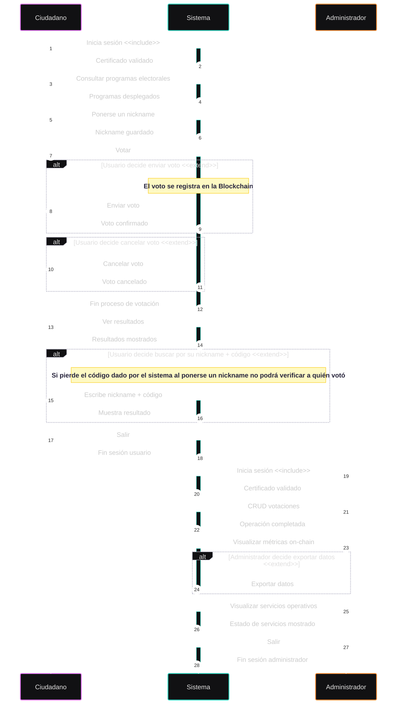
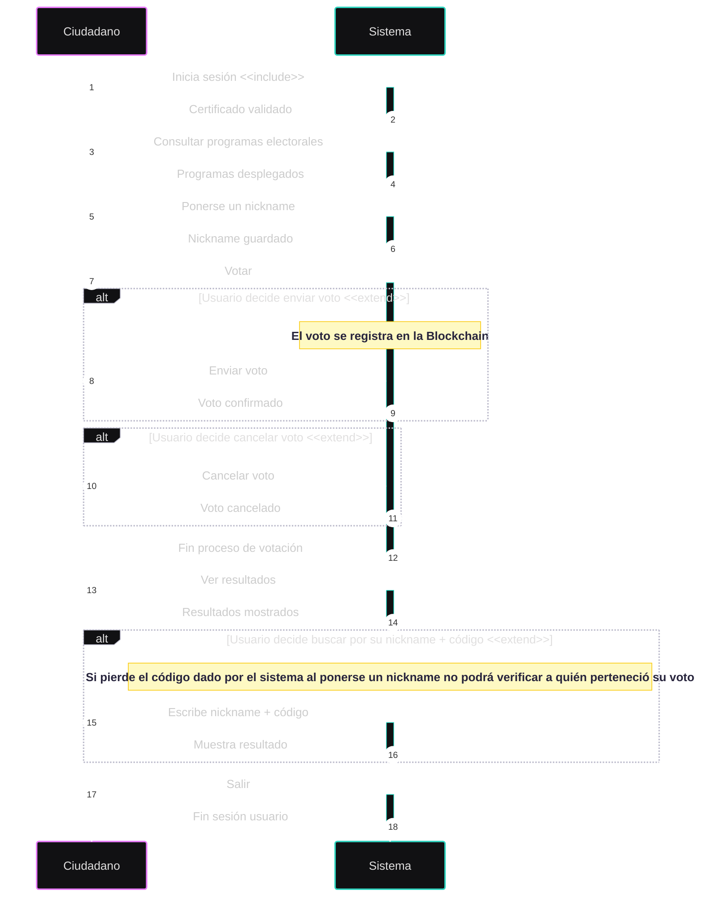
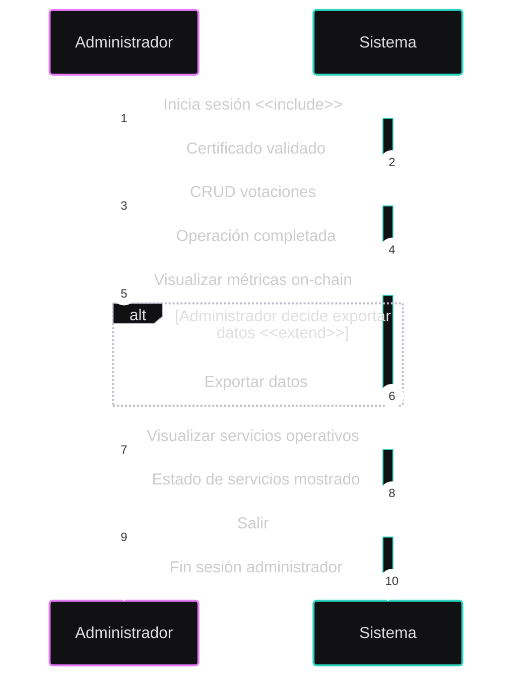

# Documentación del Diagrama de Secuencia  

## Índice
1. [Introducción](#1-introducción)
2. [Objetivo del Diagrama de Secuencia](#2-objetivo-del-diagrama-de-secuencia)  
3. [Convenciones UML Utilizadas](#3-convenciones-uml-utilizadas)
4. [Flujo de Secuencia – Actor: Ciudadano](#4-flujo-de-secuencia--actor-ciudadano)
5. [Flujo de Secuencia – Actor: Administrador](#5-flujo-de-secuencia--actor-administrador)
6. [Relación con los Casos de Uso](#6-relación-con-los-casos-de-uso)

## 1. Introducción
Este documento describe el **Diagrama de Secuencia** del Sistema de Votación Electrónica, cuyo propósito es representar de manera cronológica las interacciones entre los actores y el sistema.

Mientras que los diagramas de casos de uso definen *qué* funcionalidades ofrece el sistema, el diagrama de secuencia muestra *cómo* y *en qué orden* se ejecutan dichas funcionalidades, detallando los mensajes intercambiados y las decisiones internas del sistema.

## 2. Objetivo del Diagrama de Secuencia
El diagrama de secuencia tiene como objetivos principales:
- Representar el **flujo temporal de las operaciones** del sistema.
- Describir la interacción entre:
  - Ciudadano
  - Administrador
  - Sistema de Votación
- Modelar procesos críticos como:
  - Autenticación mediante certificado electrónico.
  - Emisión y cancelación del voto.
  - Registro del voto en la Blockchain.
  - Monitoreo de servicios operativos.
  - Gestión administrativa del sistema.
- Servir como documentación técnica para:
  - Desarrollo backend y frontend.
  - Auditorías de seguridad.
  - Validación del diseño del sistema.

## 3. Convenciones UML Utilizadas
El diagrama de secuencia se ha diseñado siguiendo las convenciones estándar UML:
- **Actores**: Representan usuarios externos al sistema.
- **Líneas de vida**: Indican la existencia de cada participante durante el tiempo.
- **Mensajes síncronos**: Representan llamadas directas al sistema.
- **Bloques `alt` / `opt`**:
  - `alt`: Flujos alternativos según condiciones.
  - `opt`: Flujos opcionales que se ejecutan solo si se cumple una condición.
- **Activaciones**: Indican periodos en los que el sistema está procesando una solicitud.   

A continuación, se muestra el diagrama de secuencia completo:

## 4. Flujo de Secuencia – Actor: Ciudadano
El flujo de interacción del **Ciudadano** se desarrolla de la siguiente manera:
1. El ciudadano accede al sistema.
2. El sistema solicita la autenticación mediante **certificado electrónico**.
3. Se valida el certificado:
   - Si el certificado es válido, el acceso es concedido.
   - Si el certificado no es válido, el acceso es denegado y el proceso finaliza.
4. Una vez autenticado, el ciudadano puede:
   - Visualizar los programas electorales.
   - Ponerse un nickname para verificar posteriormente su voto con nickname + código.
   - Votar a un partido política cuando haya una votación activa.
   - Consultar los resultados cuando la votación haya finalizado o buscar por nickname + código para comprobar a quién fue dirigido su voto.
   - Salir y cerrar sesión.
5. Si decide votar:
   - El sistema verifica si el ciudadano ya ha emitido un voto.
   - En caso negativo, se permite la emisión del voto.
6. El voto se registra de forma inmutable en la **Blockchain**.
7. Opcionalmente, el ciudadano puede cancelar el voto:
   - Solo si no se envío un voto antes, en caso afirmativo, no se podrá cancelar el voto ya que queda registrado de forma inmutable en la **Blockchain**

## 5. Flujo de Secuencia – Actor: Administrador
El flujo de interacción del **Administrador** es el siguiente:
1. El administrador accede al sistema.
2. Se autentica mediante credenciales administrativas y certificado.
3. El sistema valida los permisos asociados al rol.
4. Una vez autenticado, el administrador puede:
   - Consultar el estado de las votaciones, CRUD de votaciones.
   - Visualizar métricas almacenadas en la Blockchain.
   - Visualizar qué servicios están operativos desde la página de Monitoreo.
   - Salir y cerrar sesión.
5. Las acciones administrativas no alteran los votos emitidos, garantizando la **inmutabilidad del proceso electoral**.

## 6. Relación con los Casos de Uso
El diagrama de secuencia está directamente relacionado con los casos de uso definidos [(Casos de Uso)](Diagrama_CasosdeUso.md):
- **Iniciar sesión (certificado electrónico)**  
- **Consultar programas electorales**
- **Ponerse un nickname**
- **Votar**
- **Enviar voto**
- **Cancelar voto**
- **Ver resultados**
- **Gestionar votaciones**
- **Consultar métricas**
- **Visualizar servicios operativos**
- **Exportar métricas**
- **Salir**

Cada mensaje del diagrama de secuencia corresponde a una ejecución real de uno de estos casos de uso, permitiendo validar la coherencia del diseño del sistema.